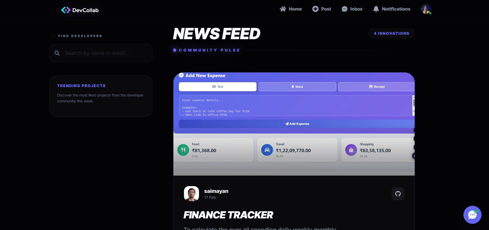
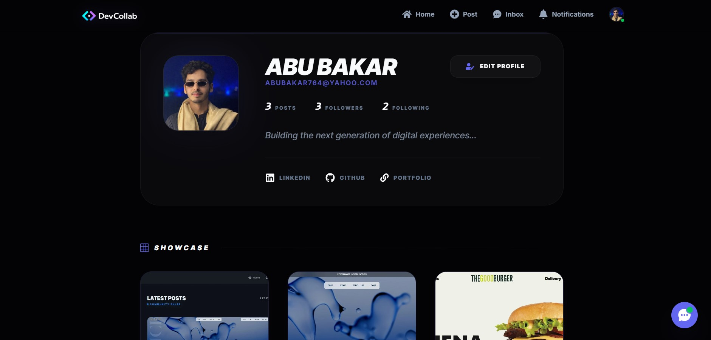
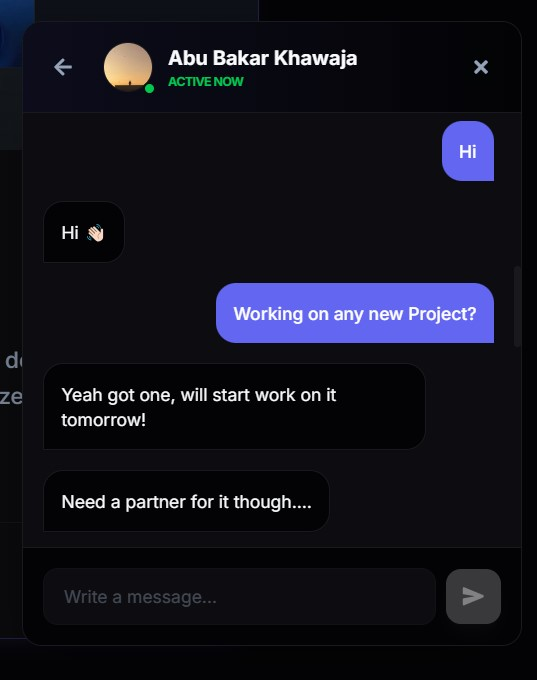
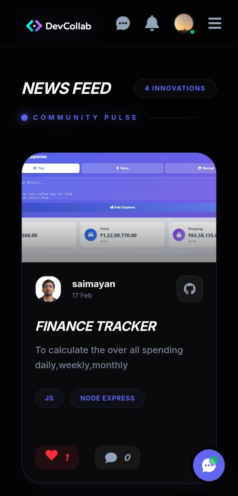

# devCollab - Frontend 💻

[](https://react.dev/)
[](https://vitejs.dev/)
[](https://tailwindcss.com/)
[](https://dev-collab-frontend-alpha.vercel.app/)

## 🚀 Overview

**devCollab** is a modern, responsive Single Page Application built for a developer-centric social experience.

It provides a focused space where developers can:

- Share progress and side projects  
- Collaborate on ideas  
- Communicate in real time  

Designed with performance, clean UI, and smooth interaction in mind.

**🌐 Live Demo:**  
https://dev-collab-frontend-alpha.vercel.app/

---

## 📸 Gallery

| Landing Page | Home Dashboard |
| :---: | :---: |
|  |  |

| User Profile | Real-time Chat |
| :---: | :---: |
|  |  |

| Mobile View |
| :---: |
|  |

---

## ✨ Key Features

- ⚡ **Real-time messaging & notifications** via Socket.io and Pusher  
- 🎨 **Modern dark UI** powered by Tailwind CSS 4 and Framer Motion  
- 📱 **Fully responsive mobile-first layout**  
- 🔐 **Secure JWT authentication** with global AuthContext  
- 🚀 **Smooth onboarding and profile setup flow**

---

## 📁 Project Structure

```text
src/
├── components/
├── context/
├── pages/
├── services/
├── utils/
└── assets/
```

---

## 🛠 Tech Stack

**React 19 · Vite · Tailwind CSS 4 · Framer Motion · React Router · Lucide Icons**

---

## 💻 Local Setup

### Install dependencies
```bash
npm install
```

### Create environment file
```env
VITE_API_URL=http://localhost:5000
VITE_PUSHER_KEY=your_pusher_key
VITE_PUSHER_CLUSTER=your_pusher_cluster
```

### Start development server
```bash
npm run dev
```

---

## 🌐 Deployment

Optimized for **Vercel**.

1. Run build:
   ```bash
   npm run build
   ```
2. Set `VITE_API_URL` to your production backend in Vercel environment variables.

---

**Built for developers.**
